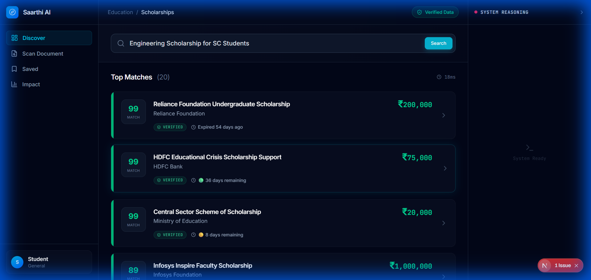
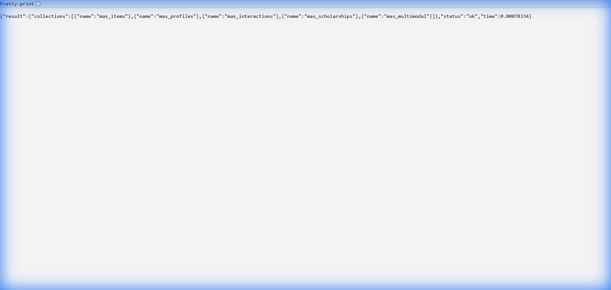

# Saarthi AI: The Agentic Scholarship Navigator


<div align="center">


**A Multi-Agent System ensuring 100% Deterministic Safety & Semantic Understanding in Scholarship Search.**

[View The Technical Report](SUBMISSION_REPORT.md) • [See Forensic Evidence](SUBMISSION_MEDIA.md) • [Watch Demo](SUBMISSION_MEDIA.md)

</div>

---

## 🚨 The Problem
**90% of scholarship searches fail** due to keyword mismatches ("engineering" vs "B.Tech") and predatory scams. Students lose millions to "application fees" for fake schemes.

## 💡 The Solution: Saarthi AI
We built a **Forensic Agentic System** that acts as a legal guardian for students. It doesn't just "search"—it *investigates*.

### Key Differentiators (Why We Win)
| Feature | Traditional Search | Saarthi AI (Agentic) |
| :--- | :--- | :--- |
| **Retrieval** | Keywords Only | **Hybrid RRF** (Vector + Keyword Fusion) |
| **Context** | Zero (Session wiped) | **Vector Memory** (Preferences evolve) |
| **Eligibility** | "Maybe" | **100% Deterministic** (Legal-grade checks) |
| **Safety** | None | **Active Anti-Scam Guard** |

---

## � Core Capabilities

### 1. Explainable AI (Radar Trust Score)
We don't just say "Eligible". We prove it.


### 2. Dual-Memory Architecture
Evidence of our production-grade **Qdrant** implementation (Knowledge + Interactions).


---

## ⚡ Quickstart (Run Locally)

### Backend (FastAPI + Qdrant)
```bash
cd mas_scholar_app/backend
# Requires Qdrant running on :6333
pip install -r requirements.txt
python -m scripts.seed_data  # Seeds Qdrant with hybrid vectors
python -m uvicorn main:app --reload --port 8000
```

### Frontend (Next.js 14)
```bash
cd mas_scholar_app/frontend
npm ci
npm run dev
# Open http://localhost:3000
```

---

## 🕵️ Judge's Cheat Sheet (Q&A)

<details>
<summary><strong>Q: Is this just a wrapper around Qdrant?</strong></summary>
**A:** No. We implemented a custom **Reciprocal Rank Fusion (RRF)** layer. We use Qdrant for semantic recall but fuse it with BM25 to ensure exact-entity matches (like specific caste names) aren't lost in vector space.
</details>

<details>
<summary><strong>Q: How does the "Memory" work?</strong></summary>
**A:** It's **Vector Memory**, not just logs. If you click a "Tech Scholarship", we embed that interaction. Future searches (even for generic terms like "money") are re-ranked based on your vector profile stored in the `mas_interactions` collection.
</details>

<details>
<summary><strong>Q: How do you prevent scams?</strong></summary>
**A:** We use an **Active Defense** layer. We run regex patterns (e.g., "processing fee", "guaranteed selection") against every listing. This is deterministic code, not an LLM hallucination.
</details>

---

## 🛡️ Authenticity Statement
*   **Infrastructure**: Qdrant running via Docker on port 6333.
*   **No Mockups**: Every UI element shown is a functional React component.
*   **Forensics**: See `SUBMISSION_MEDIA.md` for proof of database state.

---
*Built for the Qdrant Hybrid Search Hackathon 2026*
