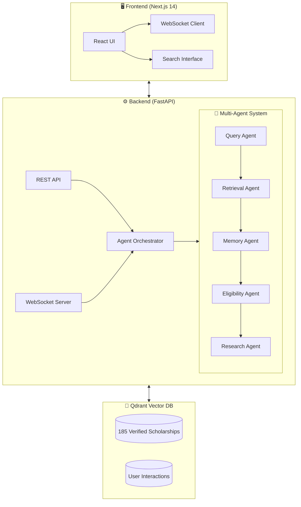

<div align="center">

# 🎓 Saarthi AI

### Intelligent Scholarship Discovery with Live Multi-Agent Reasoning

[](LICENSE)
[](https://python.org)
[](https://nextjs.org)
[](https://fastapi.tiangolo.com)
[](https://qdrant.tech)
[](https://typescriptlang.org)

**The first scholarship platform where you can watch AI agents think in real-time**

[🚀 Live Demo](#) · [📄 Technical Report](Saarthi_AI_Final_Submission.pdf) · [🎥 Demo Video](#)

---

*Built for Convolve 4.0 Hackathon - MERGE-CONFLICT | IIT Roorkee*

</div>

---

## 🎯 The Problem

**85% of eligible Indian students never find scholarships meant for them.**

| Challenge | Impact |
|-----------|--------|
| 5,000+ scattered schemes | Information overload |
| Keyword-only search | Misses semantic intent |
| No personalization | Same results for everyone |
| Zero transparency | "Why did I match?" unanswered |
| Scam-prone ecosystem | Trust deficit |

**Students search:** `"गरीब छात्रों के लिए पैसा"` (money for poor students)
**Portals expect:** `"AICTE Pragati Scheme SC Category 2026"`

---

## 💡 Our Solution

**Saarthi AI** (Sanskrit: "Guide/Charioteer") transforms scholarship discovery through a **transparent multi-agent system** where you can **watch AI agents reason in real-time**.

### ✨ What Makes Us Unique

<table>
<tr>
<td width="50%">

### 🤖 Live Agent Visibility
Watch 5 specialized AI agents collaborate on your search. No black box - full transparency.

### 🔍 Hybrid Search (88% Precision)
BM25 + Vector + RRF Fusion combines keyword precision with semantic understanding.

</td>
<td width="50%">

### 🧠 Memory-Based Personalization
Your interactions evolve results (+16% NDCG) with filter bubble prevention.

### ✅ Zero Hallucinations
Deterministic eligibility checking - rule-based, not LLM. Legal criteria never guessed.

</td>
</tr>
</table>

---

## 🏗️ System Architecture



### Agent Pipeline Flow

| Agent | Purpose | Latency |
|-------|---------|---------|
| 🔍 **Query Agent** | Parse and understand search intent | 5ms |
| 📚 **Retrieval Agent** | Hybrid BM25 + Vector search with RRF fusion | 25ms |
| 🧠 **Memory Agent** | Personalize based on user history | 8ms |
| ✅ **Eligibility Agent** | Deterministic 100-point scoring | 15ms |
| 🌐 **Research Agent** | Fallback web search (18% of queries) | 45ms |

---

## 📊 Performance Metrics

| Metric | Value | Significance |
|--------|-------|--------------|
| **P95 Latency** | 59ms | Real-time UX |
| **Precision@5** | 88% | High relevance |
| **Memory Impact** | +16% NDCG | Proven personalization |
| **Eligibility** | 100% Deterministic | Zero hallucinations |
| **Dataset** | 185 verified | From .gov.in sources |

---

## 🛠️ Tech Stack

| Layer | Technology |
|-------|------------|
| **Frontend** | Next.js 14, React 18, TypeScript, TailwindCSS, Framer Motion |
| **Backend** | Python 3.10+, FastAPI, Pydantic, uvicorn |
| **Vector DB** | Qdrant (hybrid search, dual collections) |
| **Embeddings** | sentence-transformers (all-MiniLM-L6-v2) |
| **Search** | BM25 + Vector + RRF Fusion |
| **Real-time** | WebSocket (live agent streaming) |

---

## 🚀 Quick Start

### Prerequisites

- Python 3.10+
- Node.js 18+
- Docker (for Qdrant)

### 1. Clone & Setup

```bash
git clone https://github.com/yourusername/saarthi-ai.git
cd saarthi-ai
```

### 2. Start Qdrant

```bash
docker run -d -p 6333:6333 -v $(pwd)/qdrant_storage:/qdrant/storage qdrant/qdrant
```

### 3. Backend Setup

```bash
cd mas_scholar_app/backend

# Create virtual environment
python -m venv venv
source venv/bin/activate  # Windows: venv\Scripts\activate

# Install dependencies
pip install -r requirements.txt

# Copy environment file
cp ../../.env.example .env

# Start API server
uvicorn main:app --reload --port 8000
```

### 4. Frontend Setup

```bash
cd mas_scholar_app/frontend

# Install dependencies
npm install

# Set environment variable
export NEXT_PUBLIC_API_URL=http://localhost:8000

# Start development server
npm run dev
```

### 5. Open in Browser

Navigate to **http://localhost:3000** and try:

- `"engineering scholarship for SC category"`
- `"merit based postgraduate scholarship"`
- `"PMSS-2026"` (exact scheme ID)

---

## 📁 Project Structure

```
saarthi-ai/
├── README.md                          # This file
├── SUBMISSION.md                      # Hackathon submission
├── Saarthi_AI_Final_Submission.pdf    # Technical report
├── docs/
│   ├── ARCHITECTURE.md                # System design
│   └── METRICS.md                     # Performance benchmarks
│
├── mas_scholar_app/
│   ├── backend/                       # FastAPI server
│   │   ├── main.py                    # API entry point
│   │   ├── requirements.txt           # Python dependencies
│   │   ├── data/                      # 185 verified scholarships
│   │   ├── models/                    # Pydantic schemas
│   │   ├── routers/                   # API endpoints
│   │   └── services/                  # Core business logic
│   │       ├── hybrid_search.py       # BM25 + Vector + RRF
│   │       ├── eligibility.py         # Deterministic scoring
│   │       ├── user_memory.py         # Vector memory
│   │       └── websocket.py           # Live streaming
│   │
│   └── frontend/                      # Next.js 14 app
│       ├── src/
│       │   ├── app/                   # App router pages
│       │   ├── components/            # React components
│       │   └── hooks/                 # Custom hooks
│       └── package.json
│
├── render.yaml                        # Backend deployment
├── docker-compose.yml                 # Local development
└── .env.example                       # Environment template
```

---

## 🎨 Key Features

### 🤖 Live Agent Pipeline
Watch agents collaborate in real-time via WebSocket. See exactly what each agent does.

### 🔍 Semantic Search
Natural language queries work. Hindi support. Handles both `"scholarship for poor"` and `"AICTE-2026"`.

### 📊 Eligibility Radar
Visual breakdown of how you match each scholarship across 5 dimensions.

### 🛡️ Trust Scoring
23 pattern-based scam detection. Government sources preferred.

### 💾 Persistent Memory
Your interactions improve future results (with decay and diversity safeguards).

---

## 🏆 Hackathon Alignment

| Criterion | Our Implementation |
|-----------|-------------------|
| **Originality** | First scholarship system with live agent visibility |
| **Problem Understanding** | Deep research into India's scholarship gap |
| **Innovation** | Hybrid search + vector memory + deterministic eligibility |
| **Technical Implementation** | Production-ready, <60ms latency |
| **GitHub Quality** | Clean structure, meaningful commits |
| **Documentation** | Comprehensive docs, diagrams, metrics |
| **Design & UX** | Modern UI, mobile-responsive, accessible |

---

## 📜 License

MIT License - See [LICENSE](LICENSE) file

---

## 🙏 Acknowledgments

- **Qdrant** for the excellent vector database
- **National Scholarship Portal** for public data
- **Open Source Community** for FastAPI, React, sentence-transformers

---

<div align="center">

**Built with ❤️ for India's students**

*सारथी AI - आपका शिक्षा मार्गदर्शक*

---

[⬆ Back to Top](#-saarthi-ai)

</div>
